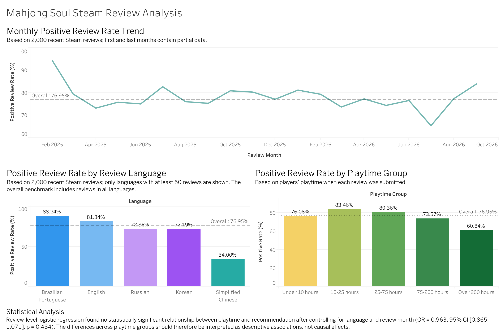

# Analysis of “Mahjong Soul” Steam Reviews

## Project Overview

This project analyzed 2,000 recent Steam reviews for “Mahjong Soul” to examine how the positive review rate varies over time, by review language, and by player playtime. The project used Python for data collection, cleaning, aggregation, and statistical analysis, and utilized Tableau Public to create an interactive dashboard.

## Research Questions

* How has the positive review rate changed over time?
* Are there differences in the positive review rate among reviews in different languages?
* How does the positive review rate differ among players in different playtime ranges?
* Is there a significant correlation between players’ playtime and the game’s recommendation status?

## Data Sources

Review data was collected via the Steam API from *Mahjong Soul* (Steam App ID: `2739990`). The dataset contains 2,000 recent reviews.

The raw review dataset is not stored in this repository but can be regenerated using the Python data collection script.
## Tools and Methods

* **Python:** API data collection, data cleaning, aggregation, and logistic regression analysis
* **Pandas and NumPy:** Data preparation and transformation
* **Statsmodels:** Logistic regression analysis at the review level
* **Tableau Public:** Dashboards and data visualization
* **Git and GitHub:** Version control and project documentation management

## Key Findings

* The overall positive rating rate is **76.95%**.
* Among language categories with 50 or more reviews, Brazilian Portuguese and English reviews have higher positive rating rates.
* Among the language categories shown, Simplified Chinese reviews have the lowest positive rating rate.
* Players with playtimes between 10 and 25 hours had the highest positive review rate, while those with playtimes exceeding 200 hours had the lowest.
* The monthly positive review rate fluctuated (Note: Data for the first and last months is incomplete).

## Statistical Analysis

Logistic regression analysis was performed at the review level to test whether playtime could predict whether a review was positive or negative. After controlling for review language and review month, playtime was not a statistically significant predictor of positive review behavior:

* **Odds ratio:** 0.963
* **95% confidence interval:** [0.865, 1.071]
* **p-value:** 0.484
* **Pseudo R²:** 0.041

Therefore, differences between groups with varying playtimes should be viewed as descriptive associations rather than evidence of a causal relationship.

## Dashboard

[View the interactive dashboard on Tableau Public](https://public.tableau.com/views/mahjongsoulanalysis/MahjongSoulSteamReviewAnalysis?:language=en-US&:sid=&:redirect=auth&publish=yes&showOnboarding=true&:display_count=n&:origin=viz_share_link)


## Repository Files

* `Steam_reviews_global.py` — Collects and processes Steam review data
* `logistic_analysis.py` — Performs logistic regression analysis at the review level
* `language_analysis.csv` — Review statistics categorized by language
* `monthly_analysis.csv` — Monthly review statistics
* `playtime_analysis.csv` — Review statistics grouped by playtime
* `logistic_regression_results.csv` — Logistic regression results
* `requirements.txt` — Required Python packages
* `dashboard.png` — Dashboard preview image

## How to Run

Install the required Python packages:

```bash
pip install -r requirements.txt
```

Collect and process Steam review data:

```bash
python Steam_reviews_global.py
```

Run the logistic regression analysis:

```bash
python logistic_analysis.py
```

## Limitations

* This analysis uses a sample of 2,000 recent reviews, not all historical reviews.
* Steam reviews are the result of user-initiated behavior and may not be representative of the entire player base.
* Data for the start and end months is incomplete.
* Observational data can only identify correlations; it cannot establish causation.
* Some variables related to Steam purchases have only a single value and cannot be included in the regression analysis as control variables.