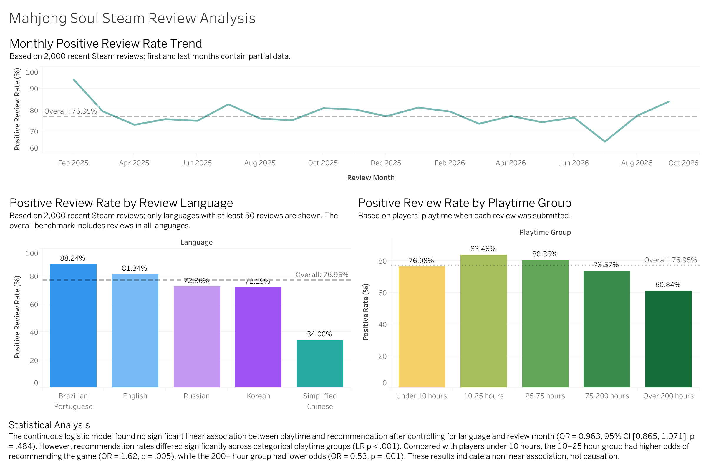
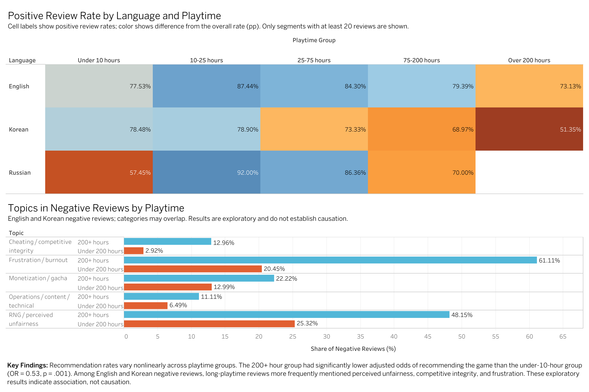

# Analysis of “Mahjong Soul” Steam Reviews

## Project Overview

This project analyzed 2,000 recent Steam reviews for “Mahjong Soul” to examine how the positive review rate varies over time, by review language, and by player playtime. The project used Python for data collection, cleaning, aggregation, and statistical analysis, and utilized Tableau Public to create an interactive dashboard.

## Research Questions

* How has the positive review rate changed over time?
* Are there differences in the positive review rate among reviews in different languages?
* How does the positive review rate differ among players in different playtime ranges?
* Is player playtime significantly associated with recommendation status after controlling for language and review month?
* Do the topics mentioned in negative reviews differ between long-playtime and shorter-playtime players?

## Data Sources

Review data was collected via the Steam API from *Mahjong Soul* (Steam App ID: `2739990`). The dataset contains 2,000 recent reviews.

The raw review dataset is not stored in this repository but can be regenerated using the Python data collection script.
## Tools and Methods

* **Python:** API data collection, data cleaning, aggregation, and logistic regression analysis
* **Pandas and NumPy:** Data preparation and transformation
* **Statsmodels:** Logistic regression analysis at the review level
* **Tableau Public:** Dashboards and data visualization
* **Git and GitHub:** Version control and project documentation management
* **SciPy:** Fisher’s exact tests for exploratory topic comparisons

## Key Findings

* The overall positive review rate was 76.95%.
* The continuous logistic model found no significant linear association between playtime and recommendation after controlling for language and review month (OR = 0.963, p = .484).
* The categorical model found significant nonlinear differences across playtime groups (LR p < .001).
* Compared with players under 10 hours, the 10–25 hour group had higher odds of recommending the game (OR = 1.62, p = .005), while the 200+ hour group had lower odds (OR = 0.53, p = .001).
* Among English and Korean negative reviews, 200+ hour players more frequently mentioned perceived unfairness, competitive integrity, and frustration or burnout.
* These findings represent associations and do not establish causation.

## Statistical Analysis

Two logistic regression models were used to examine the relationship between playtime and recommendation status while controlling for review language and review month.

The continuous model found no significant linear association between playtime and recommendation status (OR = 0.963, 95% CI [0.865, 1.071], p = .484).

However, the categorical model found significant nonlinear differences across playtime groups (LR p < .001). Compared with players under 10 hours, the 10–25 hour group had higher odds of recommending the game (OR = 1.62, p = .005), while the 200+ hour group had lower odds (OR = 0.53, p = .001).

These results indicate an association rather than a causal relationship.

## Additional Analysis

### Playtime Group Regression

A categorical logistic regression was used to examine nonlinear differences across five playtime groups while controlling for review language and review month.

### Language and Playtime Analysis

A heatmap compares positive review rates across language and playtime segments. Segments with fewer than 20 reviews are excluded to reduce instability from small sample sizes.

### Negative Review Topic Analysis

English and Korean negative reviews were classified using a bilingual keyword-based approach. The analysis compares topic prevalence between players with over 200 hours and those with under 200 hours. Categories may overlap, and the results should be interpreted as exploratory.

## Dashboards

[View the interactive dashboard on Tableau Public](https://public.tableau.com/views/mahjongsoulanalysis/PlaytimeDeepDive?:language=en-US&publish=yes&:sid=&:redirect=auth&:display_count=n&:origin=viz_share_link)

### Overview Dashboard



### Playtime Deep Dive



## Repository Files

* `Steam_reviews_global.py` — Collects and processes Steam review data
* `logistic_analysis.py` — Performs logistic regression analysis at the review level
* `language_analysis.csv` — Review statistics categorized by language
* `monthly_analysis.csv` — Monthly review statistics
* `playtime_analysis.csv` — Review statistics grouped by playtime
* `logistic_regression_results.csv` — Logistic regression results
* `requirements.txt` — Required Python packages
* `dashboard.png` — Dashboard preview image
* `playtime_group_analysis.py` — Runs categorical playtime-group logistic regression
* `playtime_group_regression_results.csv` — Regression estimates by playtime group
* `playtime_language_analysis.py` — Produces language-by-playtime statistics
* `playtime_language_analysis.csv` — Data used for the heatmap
* `review_topic_analysis.py` — Performs exploratory negative-review topic analysis
* `negative_review_topic_comparison.csv` — Topic comparison results

## How to Run

Install the required Python packages:

```bash
pip install -r requirements.txt
```

Collect and process Steam review data:

```bash
python Steam_reviews_global.py
```

Run the logistic regression analysis:

```bash
python logistic_analysis.py
```
Run the categorical playtime-group regression:

```bash
python playtime_group_analysis.py
```
Generate the language-by-playtime data:

```bash
python playtime_language_analysis.py
```
Run the exploratory negative-review topic analysis:
```bash
python review_topic_analysis.py
```
## Limitations

* This analysis uses a sample of 2,000 recent reviews, not all historical reviews.
* Steam reviews are the result of user-initiated behavior and may not be representative of the entire player base.
* Data for the start and end months is incomplete.
* Observational data can only identify correlations; it cannot establish causation.
* Some variables related to Steam purchases have only a single value and cannot be included in the regression analysis as control variables.
* The keyword-based topic classification is exploratory, categories may overlap, and the results are limited to English and Korean negative reviews.
* Language–playtime segments with fewer than 20 reviews are excluded from the